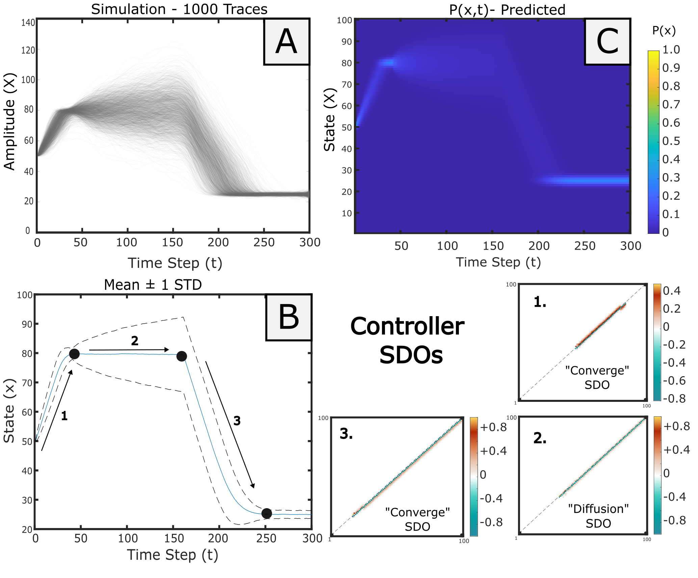

# An Example of Stochastic Control 

**NOTE:** _This section is a revised version of Appendix 3 of "Motor Modularity and Perturbation Analyzed using Stochastic Dynamic Operators" (Smith, 2025)_ 

!!! note
    The example described here is a re-analysis of the experimental system first described by Sanger (2010).   

## Targeted State Controller as an Example of Stochastic Control:

A ‘```controller```’ can be loosely defined as an agent which monitors the state of a process variable, **x**, with knowledge of target state, **y**, and attempts to perform the transformation x → y, or at least minimize the difference x-y. In classical control theory, this mapping can be described by the equation **y = H(x)**, where H(x) is the deterministic transfer function, which maps the input to output values. H(x) often takes the form of a quotient of two polynomials, each of which may contain real or imaginary roots (‘poles’ and ‘zeros’). Effectively, selection of different polynomials utilizes different combinations of x(t) to predict y.  Once solved and characterized, the transfer function and be used to predict output from any arbitrary input. 
However, when there is uncertainty in the measurement of the process variable x, or in the transformation of the process variable, via H(x), the actual system may no longer be deterministic, but stochastic. Due to uncertainty in the measurement of actual system state at any given time t, may be unknown. Instead, the value of x(t) can take on a range of potential state values, described by the distribution p(x,t). Here, we expand on a method of control utilizing p(x,t) as a fundamental unit. 

---

__Example__

To illustrate an example, we recreate a control problem illustrated by Sanger (Sanger, 2010). 
Sanger defined a simple stochastic controller using the simple differential equation: 

$$
	dx=a(x-x_0 )+e	
$$

__Definitions__

- ```dx``` = Differential of X; Change of x
- ```a``` = Scaling coefficient (equivalent to the spring constant; ratio of the difference between current and target state to set as the deterministic update)
- ```x``` = Current state. 
- ```x0``` = Target state. 
- ```e``` = Error/ Stochastic component. Typically ```e``` is normally distributed with a mean of 0. 

---
Here, x serves as the current system value, x_0 is the target system value, alpha is a scalar, and e corresponds to a white noise error term. When a 1≥a >0, the system behaves as a convergent controller, moving the system value towards a target value at a rate proportional to a. (When a is negative, this a divergent output, and when a is greater than 1, the system may ‘ring’, oscillating around the target value.) Due to the random noise term e, the system is stochastic rather than deterministic: Even when initializing the system with the same value, the exact path of each observation to the target will vary. Further, when x= x_0, there will be no directional drift component from the controller, but the process may nonetheless vary from the stochastic noise component. These paths can be realized through stimulation. 

To capture these responses as a heatmap, Sanger discretized this system into discrete time and quantized into 100 states. While Sanger did not generate SDO matrices directly, opting instead to use the quantized differential equations, we could replicate this proposed control system using only 3 matrix motifs (Figure A3.1). 

---



---

__Example of Stochastic Control__:


A) Overlay of 1000 empirical stimulations. 

B) The mean and standard deviation, drawn from all points across the ensembles. The system underwent three major phases. For period t = [0, 50], the target state was set to 80. For period t = [51, 150], there was no target. For period [150, 300], the target state was set to 25. Here, we observe that from a single common state, the system quickly adopted the first target, drifted during the second period, then converged onto the target state in the third. The mean and variance across the ensemble were measured accordingly. 

 C) Reconstruction of stochastic dynamics through three SDOs. 

 D) The SDOs used for generating system dynamics were estimated independently for each epoch. These correspond to an ‘increase’, ‘drift’, and ‘decrease’ SDO motif. SDO control can therefore be useful as a stochastic controller. 


