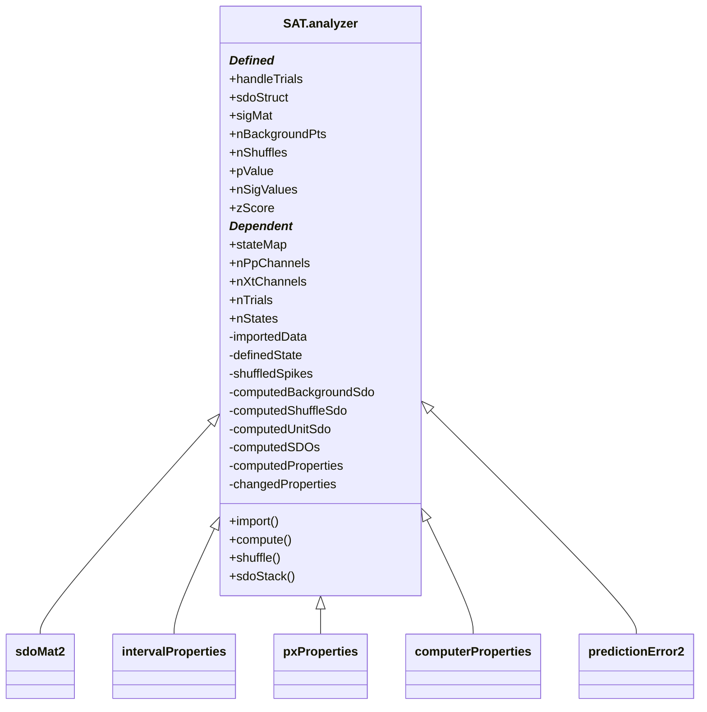

# SAT.analyzer

## Utility: 

Newer public class for performing SDO Analysis. 

The Analyzer is composed of three sdoMat2 classes, each for the 'neuron', 'background', 'shuffle' units. 

## Structure: 



## Properties

### (Composed)
* ```.unitSDO```
    - A ```sdoMat2``` class
    - Contains the spike-triggered SDOs. 

* ```.shuffleSDO```
    - A ```sdoMat2``` class
    - Contains the spike-shuffled SDOs. 

* ```.backgroundSDO```
    - A ```sdoMat2``` class
    - Contains the background SDOs. 

* ```.stateMapping```
    - A ```dataCell.stateMap``` class. 
    - Contains the state definitions for time series data.

* ```.x0Config```
    - A ```dataCell.properties.intervalProperties``` class. 
    - Contains the _pre-spike interval_ definitions and parameters. 

* ```.x1Config```
    - A ```dataCell.properties.intervalProperties``` class. 
    - Contains the _post-spike interval_ definitions and parameters. 

* ```.pxConfig```
    - A ```dataCell.properties.pxProperties``` class. 
    - Contains the definitions and parameters for drawing probability distributions from the state definitions. 

* ```.sdoConfig```
    - A ```SAT.properties.computerProperties``` class. 
    - Contains the definitions for drawing SDOs. 
    - This is the _master_ controller. Changes to this element will be pushed to the unitSDO, shuffleSDO, and backgroundSDO elements. 

* ```.predictionError```
    - A ```SAT.predict.predictError2``` class. 
    - Generated by ```.getPredictionError```. Used for plotting. 

---
### (Defined)
* ```handleTrials```
    - _string_
    - "concat"
    - _DUMMY VARIABLE_

* ```sdoStruct```
    - _struct_
    - Holder variable for the (depreciated) structure holding the SDO matrix. 
    - Used to interface with the SAT.plot. library. 
    - Populated by ```.getSdoStruct()```
    - Populated by ```.performStats()```

* ```sigMat```
    - _struct_
    - Holder variable for the sigMat struct, which is used for the identifying significant SDOs, via our significance tests. 

* ```nBackgroundPts```
    - _integer_
    - (Maximum) number of points to use for calculating background.
    - Default = 100000

* ```nShuffles```
    - _integer_
    - Number of shuffles to use for statistical testing. Larger numbers have more precise statistics, but take longer time and more space to calculate. 
    - Default = 1000

* ```pValue```
    - _numeric_
    - 1 > p > 0
    - pValue for null statistics testing. 
    - Default = 0.05

* ```nSigValues```
    - _integer_
    - Number of tests of H>1 for a neuron to be considered 'significantly different' from shuffle.
    - Default = 1. 

        +zScore

* ```sdoMatrix```
    - [N_STATES, N_STATES] matrix. dp(x1,x0)
    - Covariance-normed

* ```sdoMatrixNormed```: 
    - [N_STATES, N_STATES] matrix. dp(x1|x0)
    - Unity-normed

* ```jointMatrix```: 
    - [N_STATES, N_STATES] matrix. p(x1,x0)
    - Covariance-normed

* ```backgroundSdo```: 
    - [N_STATES, N_STATES] matrix. dp(x1,x0)
    - Covariance-normed

* ```.config```: 
    - A _SAT.properties.computerProperties_ instance. 

* ```.nEvents```: 
    - The # of events used in the SDO estimation. 

### (Dependent)
* ```px0``` <<< obj.sdoMatrixNormed; 

* ```px1``` <<< obj.sdoMatrixNormed;

* ```algorithmName``` <<< obj.config; 

* ```nSDOs``` <<< obj.sdoMatrix; 

* ```nStates``` <<< obj.sdoMatrix

##  Methods

* ```.synchConfig()```
    - Pushes changes made to the analyzer class properties to the composed classes. 

* ```.compute```(TARGET)
    - Computes the SDOs, via the ```sdoMat2``` composed classes. 
    - TARGET may be: 
        - 'unit'
        - 'shuffle'
        - 'background'
    - if TARGET is not defined, computes all three. 

* ```.shuffle```(TARGET)
    - Shuffles the target. 
    - TARGET may be: 
        - 'background'
        - 'shuffle'

* ```.getSdos```(useXtChannels, usePpChannels, vars.norm,  vars.target)
    - Returns ```sdoStack```, a cell of SDOs, which can be used for other classes/methods. 
    - INPUTS: 
        - useXtChannels = 1:MAX
        - usePpChannels = 1:MAX
        - vars.norm     = 0; [Boolean]
        - vars.target = 'unit' % {'unit', 'background', 'shuffle'}


* ```.implay```(TARGET)
    - TARGET : Which field to plot. 
        - Default = 'sdoMatrix'

* ```.plot```(XT_CH_NO, PP_CH_NO, INCLUDE_STATS)
    - Plots the selected SDO via the SAT.plot library. 
    - INPUTS
        - XT_CH_NO = 1; 
        - PP_CH_NO = 1; 
        - INCLUDE_STATS = 1

