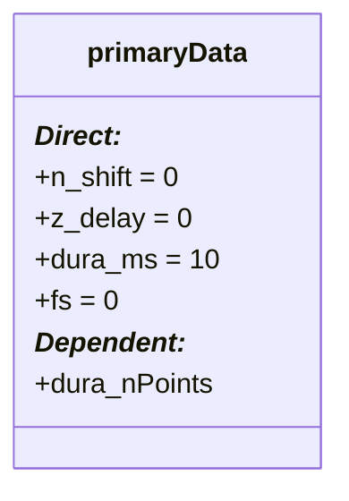

# dataCell.properties.intervalProperties

## Utility: 
- Lighweight support class containing the properties used for deriving intervals for sampling data.

## Structure: 



## Properties: 

### (Defined):
* ```n_shift```

* ```z_delay```

* ```dura_ms```
    - The relative duration intervals to draw around events. 

* ```fs```
    - Sample Frequency. Used to convert time durations to bins. 

### (Derived):
* ```dura_nPoints```
    - Converstion of ```dura_ms``` into bins. 

## Methods: 