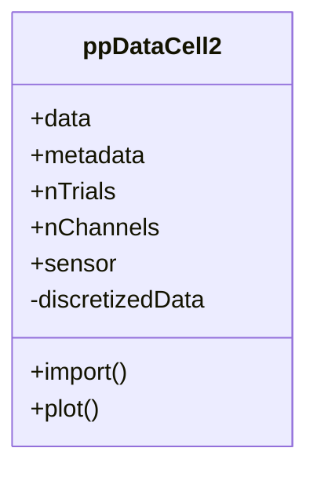

# _ppDataCell.m_

## Utility: 
Custom  Handle  class to import, manipulate,  and subsample trialwise point process (pp) data. 

!!! note deprecated
      This class is deprecated, and is kept for archival purposes with historical code. We recommend usage of [ppDataCell2](./m_ppDataCell2.md) instead, which may be replaced in-place.

## Overview: 




## Constructor
_Call within Matlab Terminal_
~~~
ppdc = ppDataCell(); 
~~~

!!! tip
    For ease of loading data into _ppDataCell_, it is recommended to first generate an instance of the _ppDataHolder_ structure, then populate accordingly: 
    ~~~
    ppdh = SAT.ppDataHolder_new(N_TRIALS, N_CHANNELS)
    ~~~

    This may then be easily loaded as: 
    ~~~
    ppdc.import(ppdh)
    ~~~

## Properties: 
* ```.data```   
   - {1 x N_TRIALS} cell containing trialwise timeseries data. See  ```SAT.ppDataHolder_new.m``` Populated by  ```.import```  method. 
* ```.metadata```  
    - {1 x N_TRIALS} cell containing trialwise meta data. See  ```SAT.ppDataHolder_new.m``` 
* ```nTrials```     
    -  [Integer]. Number of columns in  data  . 
    -  Populated by  ```.import```  method. 
* ```.nChannels``` 
   -  [Integer]. Number of rows (data channels) for each recording trial. 
    - Populated by  ```.import```  method. 
* ```.sensor``` 
   -  {1 x N_CHANNELS} cell containing strings of channel names. 
*  ```.fs``` 
   -  Sample frequency of timeseries data. 
   -  Populated by  ```.import```  method. 
   -  Modified by  ```.resample```  method. 
* ```.trTimeLen``` 
   -  [1 x N_TRIALS] doubles array, corresponding to the length of each trial in ```.data```. 
    -  Populated by  ```.import```  method. 
*  ```.dataField``` 
   -  [string]. Corresponds to fieldname in  .data  which contains time series data. 
   -  Populated by  ```.import```  method. 
*  ```.shuffMethod``` 
   -  {'isi'/'cif'}. Method for generating shuffle. See ```SAT.computeSDO.m```
   -  Default = 'isi'; 
* ```.shuffTau```
   - [Numeric]. Time constant (in sec) for defining the characteristic conditional intensity function from point-process realization. 
   - Default = 0.2
*  ```.shuffCIF```
   - {'gs', '-hg', 'expd', 'tb'}. 
   - Method for constructing the conditional intensity function. 
   - See ```SAT.computeSDO.m```


## (Selected) Methods  : 
* ```.import``` (ppData)
    ~~~
    ppdc.import(ppData)
    ~~~ 
    -  Imports  ppData  , as generated by  SAT.ppDataHolder_new.m 


*  ```.plot```  (useTrials, useChannels)
    ~~~
    xtdc.plot();
    ~~~
      - Calls two subfunctions: 
         * ```.plotWaves``` -- plot spike waveformss from selected channels
         * ```.plotSpikes``` -- plot spike time events from selected channels. 


* ```.shuffle``` (N_SHUFFLES, SHUFF_METHOD)
   - Shuffles spiketimes for null hypotheses. 
   - if ```N_SHUFFLES``` is not provided, defaults to the ```ppdc.nShuffles``` property. 
