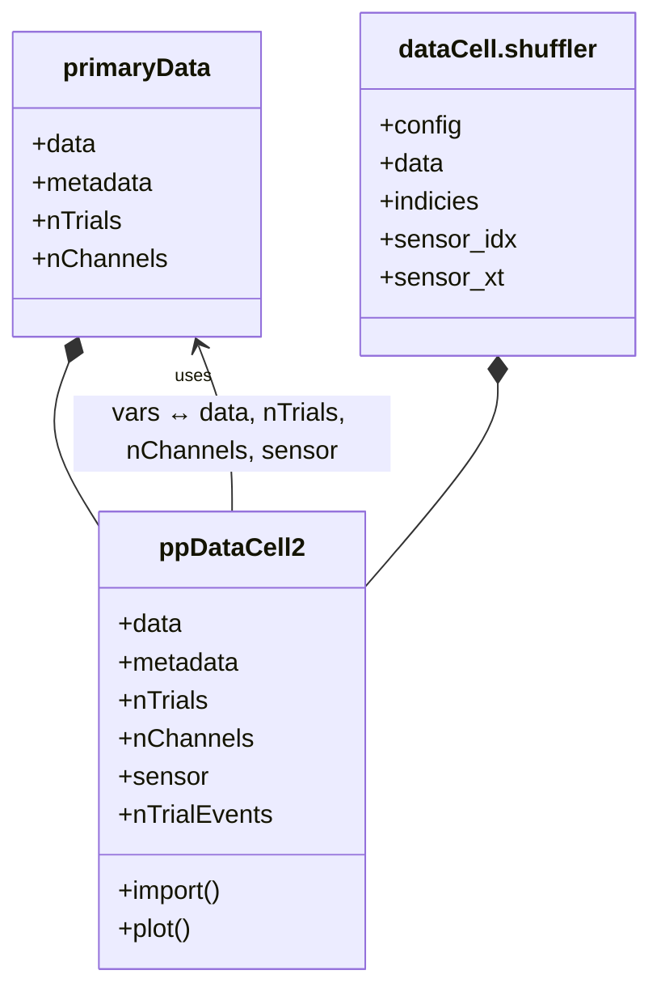

# _ppDataCell.m_

## Utility: 
Custom  Handle  class to import, manipulate,  and subsample trialwise point process (pp) data. 

## Overview: 



## Constructor
### ppDataCell2(N_TRIALS, N_CHANNELS)
_Call within Matlab Terminal_
~~~
ppdc = ppDataCell2(); 
~~~

!!! tip
    For ease of loading data into _ppDataCell_, it is recommended to first generate an instance of the _ppDataHolder_ structure, then populate accordingly: 
    ~~~
    ppdh = SAT.ppDataHolder_new(N_TRIALS, N_CHANNELS)
    ~~~

    This may then be easily loaded as: 
    ~~~
    ppdc.import(ppdh)
    ~~~

## Properties: 
### (Defined)
_None_
### (Composed)
* ```.data```   
   - A ```dataCell.primaryData``` class
   - Used to hold and manipulate trial x channel data.
* ```.shuffler```
   - A ```dataCell.shuffler``` class
   - Used to sample, generate, and hold shuffled event times.

### (Dependent)
* ```.nTrialEvents``` <<< [nChannels,nTrials] defined from obj.data
* ```.nChannels``` <<< obj.data
* ```.nTrials``` <<< obj.data
* ```.sensor``` <<< obj.data

### (Hidden, Dependent)
* ```shuffledData``` << obj.shuffler

## Methods: 
* ```.import``` (ppData)
    ~~~
    ppdc.import(ppData)
    ~~~ 
    -  Imports  ppData  , as generated by  SAT.ppDataHolder_new.m 
---
* ```.combineTrials``` (useTrials)
   ```
   ppdc.combineTrials()
   ```
   - Concatenates trials together into singular trials. 
---
- ### ```.hcat``` (dcList)
Combine the data "horizontally" in ```obj.data``` with an additional ```dataCell.primaryData``` class
- Effectively, this adds additional the new data as additional __trials__. 
!!! warning restriction
    The number of recording channels in both data structures must be the same. 
---
- ### ```.vcat``` (dcList)
Combine the data "vertically" in ```obj.data``` with an additional ```dataCell.primaryData``` class. 
- Effectively, this adds the new data as additional __channels__ within the same trials. 
!!! warning restriction
    The trialwise recording length of the new channels, and the total number of channels, must be the same for both data structures.
---
* ### [ppdc] = ```getBinnedTimestamps```(tStart, tStop, useChannels, useTrials)
- Use to bin the data within the range [tStart,tStop], for each trial, then return a new ppDataCell2.

---
* ### [xtdc] = ```.getXtDataCell```(SAMPLE_HZ, vars)
   - Conversion Method. 
---
* ### ```.plot```  (useTrials, useChannels)
    ~~~
    ppdc.plot();
    ~~~
      - Calls two subfunctions: 
         * ```.plotWaves``` -- plot spike waveformss from selected channels
         * ```.plotSpikes``` -- plot spike time events from selected channels. 


* ### ```.shuffle``` (N_SHUFFLES, SHUFF_METHOD)
   - Shuffles spiketimes for null hypotheses. 
   - if ```N_SHUFFLES``` is not provided, defaults to the ```ppdc.nShuffles``` property. 
