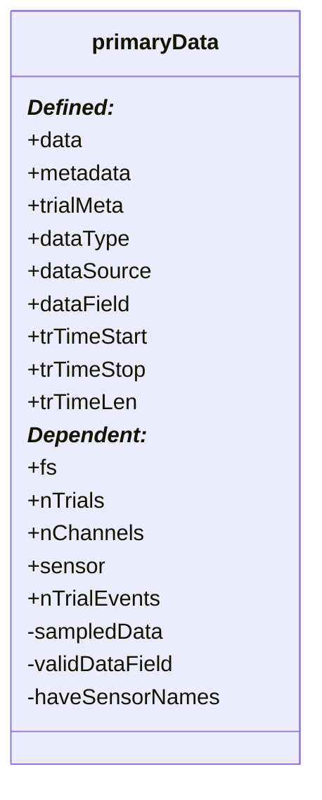

# _dataCell.primaryData_

## Utility

Support class for composing into public classes. Used to sample, hold, manipulate, and plot data. 

!!! note
    This is not a class the end-user will have to usually directly use or define. But it is composed into public classes, and passes dependent properties to these classes. 

### Inherited Classes
- _handle_
- _matlab.mixin.Copyable_

### Compositions: 
- xtDataCell2
- ppDataCell2
- sdoMat2

## Diagram


## Constructor

~~~
dataCell.primaryData(dataClass, N_TRIALS, N_CHANNELS)
~~~
- ```dataClass```: 
    - Switch for the type of class: 
        - 'ppData' --> Initialize for ```ppDataCell2```
        - 'xtData' --> Initialize for ```xtDataCell2```

## Properties
### (Defined)
- ```data```:  
    - {1, N_TRIALS} _cell_ of structures to hold data.  
- ```metadata```:
    - {1, N_TRIALS} _cell_ of structures to hold metadata.
- ```trialMeta```: 
- ```dataType```:
    - EITHER: 
        - 'xtData'
        - 'ppData'
        - 'pxtData'
- ```dataSource```:
    - Holder to save variable name during 'import'.
- ```dataField```: 
    - Which field in ```.data``` to default-call to. 
- ```trTimeStart```: 
    - [N_CHANNELS, N_TRIALS] doubles holder for holding trialwise start times. 
- ```trTimeStop```: 
    - [N_CHANNELS, N_TRIALS] doubles holder for holding trialwise end times.
- ```trTimeLen```: 
    - [N_CHANNELS, N_TRIALS] doubles houlder for holding trialwise durations. 
### (Composed)
_None_
### (Dependent)
- ```fs```: <<< obj.data 
    - Sample Frequency
- ```nTrials```: <<< obj.data
    - Number of trials (# columns of data)
- ```.nChannels```: <<< obj.data
    - Number of channels (# of rows in data{1,tr})
- ```.sensor```: <<< obj.data
    - "sensor" field in data{1,tr}
- ```.nTrialEvents```: <<< obj.data
    - [N_CHANNELS, N_TRIALS] doubles array
    - Number of observations for each row of the data field.
### (Dependent, Hidden)
- ```sampledData``` : <<< obj.data
    - [0/1]
    - If ```obj.data``` is populated. 
- ```validDataField``` : <<< obj.data
    - [0/1]
    - If ```obj.dataField``` is a field of ```obj.data```

## Methods
---
* ### ```import```(dataHolder, dataSource): 
    - Method for importing data into primaryData. 
    -  
---
* ### ``calc_trTimeLen``(): 
    - Method for validating/setting the maximum trial length. 
---
* ### ```combine```(obj2):
    - Method to combine this instance of primaryData with a second primaryData 
---
* ### ```reorder```(trialOrder, ChannelOrder): 
    - Method to reorganize the .data field
---
* ### ```subsample```(TRIAL_IDX, ROW_IDX): 
    - Method to extract only a portion from the .data field.
---
* ### ```getDataInRange```(tRange, useChannels, useTrials)
    - Method to extract a binned region of data. 
---
* ### ```resample```(DESIRED_HZ, DATAFIELD)
    - Method for changing the sample frequency (resampling). This can be upsampled or downsampled.
--- 
* ### ```convertDataType```(newDataType, vars)
    - Method for interconverting the data within ```.data``` between different classes. 
---
* ### ```vcat```(obj2)
    - Vertical Concatenation
    - Used to combine two ```primaryData``` objects together: Adds additional **channels** to existing trials.
    !!! warning
        Each new channel must have the same data length as the original data.

---
* ### ```hcat```(obj2)
    - Horizontal Concatenation 
    - Used to combine two ```primaryData``` objects together: Adds additional **trials** to data. 
    !!! warning
        Each trial must have the same number of channels as the original data. 