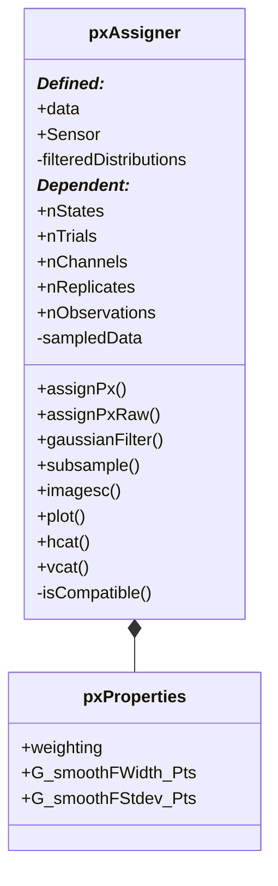

# dataCell.pxAssigner

## Utility: 
Class for sampling, holding, and manipulating probability data : p(x).  

## Compositions:
- ```sdoMat2```
- ```SAT.analyzer```

## Overview: 

## Properties: 
* ### ```assignPx```(stateMap, intervalData)

* ### ```assignPxRaw```(stateMap, xCell)
    - ```xCell``` is a cell of data.

* ### ```gaussianFilter```():

* ### ```subsample```(useXtChannels, useTrials, usePpChannels)

* ### ```imagesc```(useTrials, useChannels, useReplicates)

## Methods