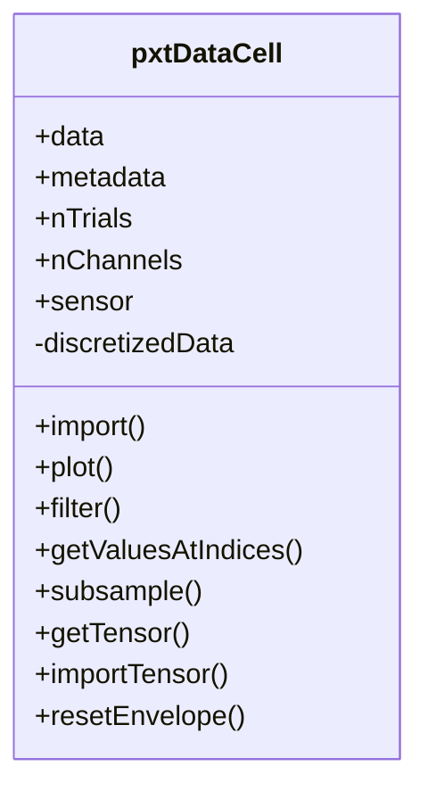

# _pxtDataCell.m_

## Utility: 
Custom  Handle  class to Import, manipulate,  and subsample sampled probability distributions.

!!! warning
    - This class is partially deprecated for end-user applications, as it can be a bit tricky to set all the parameters, and ensure consistency in sampling. It is used mostly within functions. 
    - It is recommended to use _sdoMultiMat_ or _sdoMat_ to generate SDOs, and to extract _pxtDataCells_ through ```.get``` methods instead of directly instantiating this class. 


## Overview: 




## Constructor
_Call within MATLAB_
~~~
pxt = pxtDataCell(); 
~~~


## Properties: 

*  ```.xtName``` 
      -  xtDataCell.dataField 
      -  Populated by  .import 

* ```.ppName```  
   -  ppDataCell.dataField 
   -  Populated by  .import 

* ```.xtChName``` 
      -  xtDataCell channel name of imported data. 
      -  Populated by  .import 

* ```.ppChName``` 
      -  ppDataCell channel name of imported data.  
      -  Populated by  .import 

* ```.pxtNames``` 
      -  {1x nPxtTypes} cell of of  char  . Corresponds to type  of prediction.     
      -  Populated by  ```.import`` 
   -  Populated by ```.comparePxt``` 

* ```.nPxtTypes``` 
      -  [int]. Number of dataTypes/predictions contained within the  pxtDataCell.   

* ```.nEvents``` 
      -  [int]. Number of events around which distributions are drawn. 

* ```.nShuffles``` 
      -  [int]. Number of shuffles generated in  pxt. 
      -  Populated by  ```.import```  from  ```ppDataCell.```

* ```.xtProperties``` 
      -  Metadata of  [xtDataCell](./m_xtDataCell.md) 

* ```.ppProperties``` 
      -  Metadata of  [ppDataCell](./m_ppDataCell.md) 

* ```.duraMs``` 
      -  [double]. Duration of interval over which to derive event-wise distributions. 
      -  If  .duraMs  < 0, then sample this interval PRIOR to  event. 
      -  If .  duraMs  > 0, then sample this interval AFTER to  event. 
      -  Default = +10 

* ```.nShift``` 
      -  Shift in the the start time for pre/post spike interval. See  SAT.computeSDO.m 
      -  Default = 1; 

* ```.zDelay``` 
      -  Interval between pre/post spike interval. See  SAT.computeSDO.m 
      -  Default = 0; 

* ```.filterWid``` 
      -  Width of the smoothing filter, in states. See  SAT.computeSDO.m 
      -  Default = 0; 

* ```.filterStd``` 
      -  Standard deviation of the smoothing filter, in states. See  ```SAT.computeSDO.m``` 
   -  Default = 0; 

* ```.nStates``` 
      -  Number of states used to rasterize signal. 
      -  Populated by .import  from [xtDataCell](./m_xtDataCell.md). 

 *  ```.fs``` 
   -  Sample frequency of timeseries data. 
   -  Populated by  ```.import```  method. 
   -  Modified by  ```.resample```  method.   

* ```.stateMapping``` 
      -  [1 x N_STATES+1] corresponding to the edges of the state bins. 
      -  Populated by ```.import```  from  [xtDataCell](./m_xtDataCell.md). 

* ```.backgroundPx``` 
      -  [N_STATES x 1] Probability distribution; average P(x) 
      -  Populated by  ```.import``` 

* ```.backgroundMkv``` 
      -  [N_STATES x N_STATES] Markov Matrix, corresponding to background transitions (over ```.duraMs```). 
      -  Populated by  ```.import```
   
* ```.markovMatrix``` 
      -  [N_STATES x N_STATES] Markov Matrix, corresponding to transitions over adjacent states. 
      -  Populated by  ```.import```

* ```.data``` 
      -  {1 x nPxtTypes} cell containing [N_STATES x N_EVENTS] doubles cell, containing trialwise probability data. 

* ```.stateAssignment``` 
      -  {‘max’, ‘mean’, ‘median’} - Description of assigning single state to a distribution. 
   -  Default = ‘max’ 

* ```.errorStruct``` 
      -  Error structure, containing the distance between a reference __pxtDataCell__ and second __pxtDataCell__. 
      -  Populated by ```.comparePxt```

## (Selected) Methods  : 
* ```.import``` ([xtDataCell](./m_xtDataCell.md), [ppDataCell](./m_ppDataCell.md), XT_CH_NO, PP_CH_NO)
    ~~~
    pxt.import(xtdc, ppdc, 6, 4); 

    % Sample probability distributions from xtdc and ppdc, for channel #6 from xtdc, and channel #4 from ppdc. 
    ~~~ 

*  ```.bsxop```  (  pxtDataCell  , funcHandle) 
    ~~~
    xtdc.bsxop([], @abs())
    # Perform data rectification
    ~~~
    -  Perform bitwise operations between two  xtDataCells  of the same size (i.e., sum, multiply) 
    -  ```funcHandle```  is a standard MATLAB function handle.

* ```.comparePxt```(pxtDataCell)
      - Measure the distance between this _pxtDataCell_ and a second _pxtDataCell_
      - Populates the ```.errorStruct``` field.  

*  ```.plot```()
      - Plots the the probability data, as collected over time, using the _imagesc_ MATLAB plotter. 

* ```.plotError```()
      - Plots the ```.errorStruct``` field, if present. 
