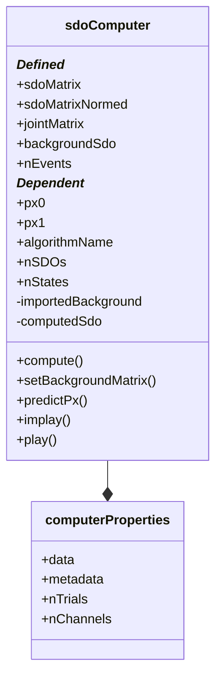

# SAT.sdoComputer

## Utility: 

Used as the core compute kernel class to estimate the SDO. 

This class takes the minimal amount of data necessary to compute the class. 

## Structure: 



## Properties

### (Defined)
* ```sdoMatrix```
    - [N_STATES, N_STATES] matrix. dp(x1,x0)
    - Covariance-normed

* ```sdoMatrixNormed```: 
    - [N_STATES, N_STATES] matrix. dp(x1|x0)
    - Unity-normed

* ```jointMatrix```: 
    - [N_STATES, N_STATES] matrix. p(x1,x0)
    - Covariance-normed

* ```backgroundSdo```: 
    - [N_STATES, N_STATES] matrix. dp(x1,x0)
    - Covariance-normed

* ```.config```: 
    - A _SAT.properties.computerProperties_ instance. 

* ```.nEvents```: 
    - The # of events used in the SDO estimation. 

### (Dependent)
* ```px0``` <<< obj.sdoMatrixNormed; 

* ```px1``` <<< obj.sdoMatrixNormed;

* ```algorithmName``` <<< obj.config; 

* ```nSDOs``` <<< obj.sdoMatrix; 

* ```nStates``` <<< obj.sdoMatrix

##  Methods

* ```.compute```(px0, px1)
    - ```px0``` : a [dataCell.pxAssigner](./m_pxAssigner.md) instance. 
    - ```px1``` : a [dataCell.pxAssigner](./m_pxAssigner.md) instance.

* ```.setBackgroundMatrix```(VAR)

* [px1_est] = ```.predictPx```(px0)
    - ```px0```     : a [dataCell.pxAssigner](./m_pxAssigner.md) instance. 
    - ```px1_est``` : a [dataCell.pxAssigner](./m_pxAssigner.md) instance. 

* ```.implay```(TARGET)
    - TARGET : Which field to plot. 
        - Default = 'sdoMatrix'

* ```.plot```()
