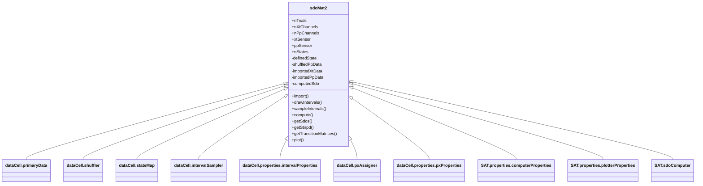

# _sdoMat2.m_

## Utility: 

Upgraded version of the custom classes which effectively overshadows the orignal [sdoMat](./m_sdoMat.md) and partially overshadows the [sdoMultiMat](./m_sdoMultiMat.md)

This class handles the core interfacing with the primary data classes ( [xtDataCell](./m_xtDataCell.md), [xtDataCell2](./m_xtDataCell2.md), [ppDataCell](./m_ppDataCell.md), [ppDataCell2](./m_ppDataCell2.md) ) with the [sdoComputer](./m_sdoComputer.md) elements.

Custom  Handle  class to generate single SDOs from instances of [pxtDataCell](./m_pxtDataCell.md), and to plot associated errorrs.


## Overview: 




## Constructor
_Call within MATLAB_
~~~
sdoM = sdoMat(); 
~~~

!!! bug TODO: 
       - Upgrade this section with metadata classes on xtDataCell, ppDataCell --> pxtDataCell; import metadata from pxtDataCell. 

## Properties: 

*  ```.xtData``` 
      - An instance of the ```dataCell.primaryData``` class. 
      - Comprises the time-series data, x(t).
      - Populated by  ```.import()``` from an ```xtDataCell``` or ```xtDataCell2``` instance.

* ```.ppData```
    - An instance of the ```dataCell.primaryData``` class. 
    - Comprises the point-process data. 
    - Populated by ```.import()``` from a ```ppDataCell``` or ```ppDataCell2``` instance.

* ```.eventShuffle```
    - An instance of the ```dataCell.shuffler``` class.
    - Comprises the shuffling metrics for the point-process data. 
    - Populated by ```.import()``` from a ```ppDataCell``` or ```ppDataCell2``` instance. 
      


* ```.ppName```  
   -  ppDataCell.dataField 
   -  Populated by  ```.import``` 

* ```.xtChName```
    - xtDataCell channel name of imported data. 
    - Populated by  ```.import``` 

* ```.ppChName``` 
    - ppDataCell channel name of imported data.  
    - Populated by  ```.import``` 

* ```.pxtNames``` 
    - {1x nPxtTypes} cell of of  char  . Corresponds to type  of prediction.     
    - Populated by  ```.import`` 
    - Populated by ```.comparePxt``` 

* ```.nPxtTypes``` 
    - [int]. Number of dataTypes/predictions contained within the  [pxtDataCell](./m_pxtDataCell.md).   

* ```.nEvents``` 
    - [int]. Number of events around which distributions are drawn. 

* ```.nShuffles``` 
    -  [int]. Number of shuffles generated in  pxt. 
    -  Populated by  ```.import```  from  [ppDataCell](./m_ppDataCell.md)

* ```.xtProperties``` 
    -  Metadata of  [xtDataCell](./m_xtDataCell.md) 

* ```.ppProperties``` 
    -  Metadata of  [ppDataCell](./m_ppDataCell.md) 

* ```.px0_duraMs``` 
    -  [double]. Duration of interval over which to derive event-wise distributions. 
    -  If .duraMs  < 0, then sample this interval PRIOR to  event. 
    -  If .duraMs  > 0, then sample this interval AFTER to  event. 

* ```.px1_duraMs``` 
    -  [double]. Duration of interval over which to derive event-wise distributions.
    -  If .duraMs  < 0, then sample this interval PRIOR to  event.-  If .duraMs  > 0, then sample this interval AFTER to  event. 

* ```.nShift``` 
    - Shift in the the start time for pre/post spike interval. See  SAT.computeSDO.m 
    -  Default = 1; 

* ```.zDelay``` 
    -  Interval between pre/post spike interval. See ```SAT.computeSDO.m``` 
    -  Default = 0; 

* ```.sdo```
    - [N_STATES,N_STATES] SDO (differential) matrix corresponding to the combination of xtDataCell channel and ppDataCell channel. 
    - Populated by ```.import``` 

* ```.filterWid``` 
    -  Width of the smoothing filter, in states. See  SAT.computeSDO.m 
    -  Default = 0; 

* ```.filterStd``` 
    -  Standard deviation of the smoothing filter, in states. See  ```SAT.computeSDO.m``` 
    -  Default = 0; 

* ```.nStates``` 
    -  Number of states used to rasterize signal. 
    -  Populated by .import  from [xtDataCell](./m_xtDataCell.md). 

*  ```.fs``` 
   -  Sample frequency of timeseries data. 
   -  Populated by  ```.import```  method. 
   -  Modified by  ```.resample```  method.   

* ```.stateMapping``` 
    -  [1 x N_STATES+1] corresponding to the edges of the state bins. 
    -  Populated by ```.import```  from  [xtDataCell](./m_xtDataCell.md). 

* ```.backgroundPx``` 
    -  [N_STATES x 1] Probability distribution; average P(x) 
    -  Populated by  ```.import``` 

* ```.backgroundMkv``` 
    -  [N_STATES x N_STATES] Markov Matrix, corresponding to background transitions (over ```.duraMs```). 
    -  Populated by  ```.import```
   
* ```.markovMatrix``` 
    -  [N_STATES x N_STATES] Markov Matrix, corresponding to transitions over adjacent states. 
    -  Populated by  ```.import```

* ```.markovType```
    - {'px0', 'px1'}
    - Whether to use the Markov Matrix from the prespike (px0) or postspike (px`) [pxtDataCell](./m_pxtDataCell.md) during import. 

* ```.transitionMat```
    - Populated by ```.matkeTransitionMatrices```
    - Comprises a version of the SDO for use in forward prediction (normalized). 

## (Selected) Methods  : 
* ```.import``` ([pxtDataCell](./m_pxtDataCell.md), [pxtDataCell](./m_pxtDataCell.md)); 
    ~~~   
    sdoM.import(pxt0, pxt1)

    % Calculate the SDO measured between the observed probability distributions in pxt0 and the transitions (post-spike) to pxt1.
    ~~~ 
!!! note
    - Here, _pxt0_ and _pxt1_ must be [pxtDataCell](./m_pxtDataCell.md) classes with the same number of events, number of state, and state definition. 
    - This is most easily handled by first making _pxt0_ making a copy as _pxt1_, then modifying the relevant parameters.

*  ```.plot```()
      - Plots the the probability data, as collected over time, using the _imagesc_ MATLAB plotter. 

