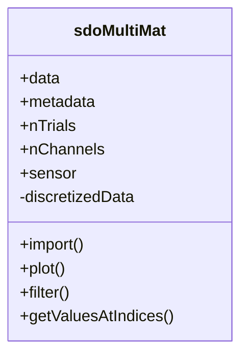

# _sdoMultiMat.m_

## Utility: 
Custom  Handle  class to generate single SDOs from instances of [xtDataCell](./m_xtDataCell.md) and [ppDataCell](./m_ppDataCell.md). 


## Overview: 




## Constructor
_Call within MATLAB_
~~~
smm = sdoMultiMat(); 
~~~

!!! bug TODO: 
       - Upgrade this section with metadata classes on xtDataCell; import metadata from pxtDataCell. 

## Properties: 
* ```.nXtChannels``` 
    -  [int] Number of xtChannels used from  xtDataCell 
    -  Populated by  ```.compute``` 

* ```.nPpChannels``` 
    -  [int] Number of ppChannels 

*  ```.xtName``` 
      - xtDataCell.dataField 
      - Populated by  ```.import``` 

* ```.ppName```  
   -  ppDataCell.dataField 
   -  Populated by  ```.import``` 

* ```.xtChName```
    - xtDataCell channel name of imported data. 
    - Populated by  ```.import``` 

* ```.ppChName``` 
    - ppDataCell channel name of imported data.  
    - Populated by  ```.import``` 

* ```.pxtNames``` 
    - {1x nPxtTypes} cell of of  char  . Corresponds to type  of prediction.     
    - Populated by  ```.import`` 
    - Populated by ```.comparePxt``` 

* ```.nPxtTypes``` 
    - [int]. Number of dataTypes/predictions contained within the  [pxtDataCell](./m_pxtDataCell.md).   

* ```.nEvents``` 
    - [int]. Number of events around which distributions are drawn. 

* ```.nShuffles``` 
    -  [int]. Number of shuffles generated in  pxt. 
    -  Populated by  ```.import```  from  [ppDataCell](./m_ppDataCell.md)

* ```.xtProperties``` 
    -  Metadata of  [xtDataCell](./m_xtDataCell.md) 

* ```.ppProperties``` 
    -  Metadata of  [ppDataCell](./m_ppDataCell.md) 

* ```.px0_duraMs``` 
    -  [double]. Duration of interval over which to derive event-wise distributions. 
    -  If .duraMs  < 0, then sample this interval PRIOR to  event. 
    -  If .duraMs  > 0, then sample this interval AFTER to  event. 

* ```.px1_duraMs``` 
    -  [double]. Duration of interval over which to derive event-wise distributions.
    -  If .duraMs  < 0, then sample this interval PRIOR to  event.-  If .duraMs  > 0, then sample this interval AFTER to  event. 

* ```.nShift``` 
    - Shift in the the start time for pre/post spike interval. See  SAT.computeSDO.m 
    -  Default = 1; 

* ```.zDelay``` 
    -  Interval between pre/post spike interval. See ```SAT.computeSDO.m``` 
    -  Default = 0; 

* ```.sdo```
    - [N_STATES,N_STATES] SDO (differential) matrix corresponding to the combination of xtDataCell channel and ppDataCell channel. 
    - Populated by ```.import``` 

* ```.filterWid``` 
    -  Width of the smoothing filter, in states. See  SAT.computeSDO.m 
    -  Default = 0; 

* ```.filterStd``` 
    -  Standard deviation of the smoothing filter, in states. See  ```SAT.computeSDO.m``` 
    -  Default = 0; 

* ```.nStates``` 
    -  Number of states used to rasterize signal. 
    -  Populated by .import  from [xtDataCell](./m_xtDataCell.md). 

*  ```.fs``` 
   -  Sample frequency of timeseries data. 
   -  Populated by  ```.import```  method. 
   -  Modified by  ```.resample```  method.   

* ```.stateMapping``` 
    -  [1 x N_STATES+1] corresponding to the edges of the state bins. 
    -  Populated by ```.import```  from  [xtDataCell](./m_xtDataCell.md). 

* ```.backgroundPx``` 
    -  [N_STATES x 1] Probability distribution; average P(x) 
    -  Populated by  ```.import``` 

* ```.backgroundMkv``` 
    -  [N_STATES x N_STATES] Markov Matrix, corresponding to background transitions (over ```.duraMs```). 
    -  Populated by  ```.import```

## (Selected) Methods  : 
* ```.compute``` ([xtDataCell](./m_xtDataCell.md), [ppDataCell](./m_ppDataCell.md), USE_XT_CH, USE_PP_CH); 
    ~~~   
    smm.compute(xtdc, ppdc, 6,4)

    % Calculate the SDO measured between the observed probability distributions in pxt0 and the transitions (post-spike) to pxt1.
    ~~~ 
    - if ```USE_XT_CH``` or ```USE_PP_CH``` are not provided, they will default to all the channels in the [xtDataCell](./m_xtDataCell.md) or [ppDataCell](./m_ppDataCell.md).

!!! note
    _sdoMultiMat_ does not contain an explicit import method, instead this is called directly from the script. 

*  ```.plot```()
      - Plots all sdo Plot features. 

