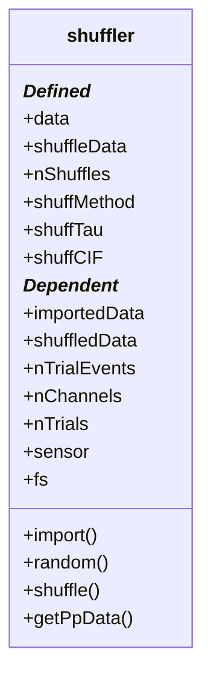

# dataCell.shuffler

## Utility: 

Support Class for generating and sampling random shufflers. 

## Compositions:

- ppDataCell2
- sdoMat2


## Structure: 



## Properties

## Methods

* ### ```import```(data):
    - ```data```: A [dataCell.primaryData](./m_primaryData.md) class. 

* ### ```random```(nTrials, nChannels, nEvents, vars):
    - vars.maxX
    - vars.type 
        - 'times'
        - 'index'
        - 'all'
    - vars.link
        - 'none'
        - 'trials'
        - 'channels'
        - 'both'
    - vars.seed

* ### ```shuffle```(data, vars): 
    - vars.useTrials 
    - vars.useChannels

* ### ```getPpData```(vars.flatten): 


