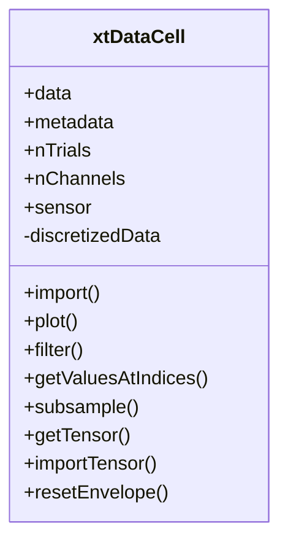

# _xtDataCell.m_

## Utility: 
Custom  Handle  class to Import, manipulate,  and subsample trialwise time series "_x(t)_" data. 

## Overview: 





## Properties: 
- ```.data```   
    - {1 x N_TRIALS} cell containing trialwise timeseries data. See  ```SAT.xtDataHolder_new.m``` Populated by  ```.import```  method. 
- ```.metadata```  
    - {1 x N_TRIALS} cell containing trialwise meta data. See  ```SAT.xtDataHolder_new.m``` 
- ```nTrials```     
    -  [Integer]. Number of columns in  data  . 
    -  Populated by  ```.import```  method. 
- ```.nChannels``` 
   -  [Integer]. Number of rows (data channels) for each recording trial. 
    - Populated by  .import  method. 
- ```.sensor``` 
    -  {1 x N_CHANNELS} cell containing strings of channel names. 
-  ```.fs``` 
    -  Sample frequency of timeseries data. 
    -  Populated by  ```.import```  method. 
    -  Modified by  ```.resample```  method. 
- ```.trTimeLen``` 
    -  [1 x N_TRIALS] doubles array, corresponding to the length of each trial in ```.data```. 
    -  Populated by  ```.import```  method. 
-  ```.dataField``` 
    -  [string]. Corresponds to fieldname in  .data  which contains time series data. 
    -  Populated by  ```.import```  method. 
-  ```.channelAmpMax```  : 
    -  [N_CHANNELS x N_TRIALS] doubles array, corresponding to maximum observed value. 
   -  Populated by  ```.import```  method. 
- ```.channelAmpMin``` 
    -  [N_CHANNELS x N_TRIALS] doubles array, corresponding to minimum observed value. 
   -  Populated by  .import  method. 
-  ```.mapMethod``` 
    -  {‘linear’, ‘log’, ‘linearsigned’, ‘logsigned’}. Method for defining state. See ```SAT.computeSDO.m``` 
    -  Default = ‘log’ 
- ```.maxMode```    
    -  {‘pTrial’, ‘xTrialxSeg’}. Method for determining trial min/max. See  ```SAT.computeSDO.m``` 
    -  Default = ‘xTrialxSeg’ 
-  ```.nBins``` 
    -  [Integer]. Number of states to define between min/max amplitude. 
    -  Default = 20 

## (Selected) Methods  : 
---
- ### ```.import``` (xtData)
    ~~~
    xtdc.import(xtData)
    ~~~ 
    -  Imports  xtData  , as generated by  SAT.xtDataHolder_new.m 
---
- ### ```.resample```  ( DESIRED_HZ, DATAFIELD)
    ~~~
    xtdc.resample(1000, 'envelope')
    ~~~
     -  Resample time series data in data. ```DATAFIELD``` to a given frequency (DESIRED_HZ) 
    - Defaults  : 
        -  ```DESIRED_HZ```  = obj```.fs``` 
        -  ```DATAFIELD```  = obj```.dataField``` 
---
- ### ```.bsxop```  (  xtDataCell  , funcHandle) 
    ~~~
    xtdc.bsxop([], @abs())
    # Perform data rectification
    ~~~
    -  Perform bitwise operations between two  xtDataCells  of the same size (i.e., sum, multiply) 
    -  ```funcHandle```  is a standard MATLAB function handle.
---
- ### ```.plot```  (useTrials, useChannels, OFFSET, DATAFIELD): 
    ~~~
    xtdc.plot();
    ~~~
    -  Co-plot the appended time series data (or subset). Segregate traces by  OFFSET  or autodefine. 
     -  Defaults: 
        -  useTrials   = 1:obj```.nTrials```; 
        -  useChannels = 1:obj```.nChannels```; 
     -  OFFSET  = []; 
    -  DATAFIELD  = obj.dataField 
---
- ### ```.getTensor```  (useChannels, useTrials) 
    ~~~
    xten = xtdc.getTensor(); 
    ~~~
    -  Extracts a 3D data array (or subset of) from the .  data  field as a 
    -  (N_USED_CHANNELS, xtDataLen,N_USED_TRIALS) doubles tensor 
    -  Defaults  : 
        -  useChannels  = 1:obj.nChannels; 
        -  useTrials  = 1:obj.nTrials;
---
- ### ```.importTensor```  (ten): 
    ~~~
    xtdc.importTensor(ten)
    ~~~
    -  Imports a 3D data tensor (ten) to the  .data  field, in the same format as the  ```.getTensor```  method. 
---
- ### ```.discretize```  : 
    -  Assign state mapping to the xtData using set parameters.
    ~~~
    xtdc.discretize();
    ~~~