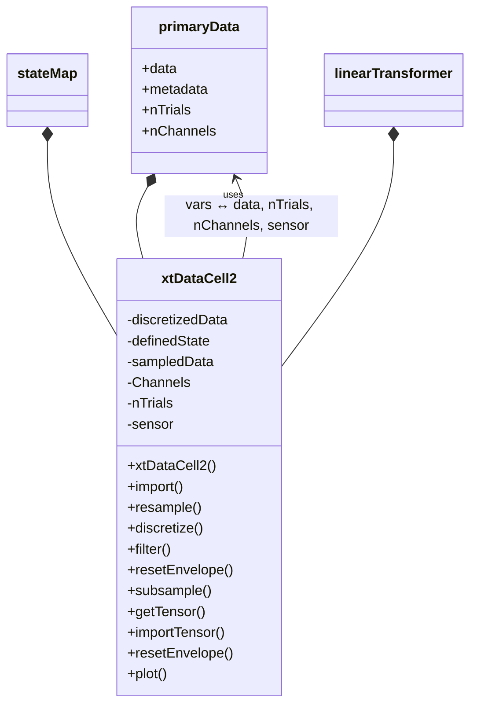

# _xtDataCell2.m_

## Utility: 
Public  Handle  class to import, manipulate, plot,  and subsample trialwise time series "_x(t)_" data. 


## Overview: 



## Properties: 
### (Defined):
_None_
### (Composed): 
- ```.data```: A ```dataCell.primaryData``` class. 

- ```.stateMap```: A ```dataCell.stateMap``` class. 

- ```.linearTransform```: A ```dataCell.linearTransformer``` class. 

### (Dependent): 
- ```.nChannels``` << _obj.data.nChannels_

- ```.nTrials``` << _obj.data.nTrials_

- ```.sensor``` << _obj.data.sensor_

### (Hidden, Dependent):
- ```.discretizedData```: << _obj.data.discretizedData_

- ```.definedState```: << _obj.stateMap_

- ```.sampledData```: << _obj.data.sampledData_


## (Selected) Methods  : 
---
- ### ```.import``` (xtData)
    ~~~
    xtdc.import(xtData)
    ~~~ 
    -  Imports  xtData  , as generated by  SAT.xtDataHolder_new.m 
---
- ### ```.resample```  ( DESIRED_HZ, DATAFIELD)
    ~~~
    xtdc.resample(1000, 'envelope')
    ~~~
     -  Resample time series data in data. ```DATAFIELD``` to a given frequency (DESIRED_HZ) 
    - Defaults  : 
        -  ```DESIRED_HZ```  = obj```.fs``` 
        -  ```DATAFIELD```  = obj```.dataField``` 
---
- ### ```.discretize``` (vars) 
    - vars.dataField = obj.data.dataField; 
    - vars.allowClipping = 1; 
    -  Assign state mapping to the xtData using set parameters.
    ~~~
    xtdc.discretize();
    ~~~
---
- ### ```.combineTrials``` (useTrials)
---
- ### ```.hcat``` (dcList)
Combine the data "horizontally" in ```obj.data``` with an additional ```dataCell.primaryData``` class
- Effectively, this adds additional the new data as additional __trials__. 
!!! warning restriction
    The number of recording channels in both data structures must be the same. 
---
- ### ```.vcat``` (dcList)
Combine the data "vertically" in ```obj.data``` with an additional ```dataCell.primaryData``` class. 
- Effectively, this adds the new data as additional __channels__ within the same trials. 
!!! warning restriction
    The trialwise recording length of the new channels, and the total number of channels, must be the same for both data structures.
---
- ### ```.filter``` (FILTERTYPE, N_POINTS, F_VAR, vars)
    - ```FILTERTYPE```: 
        - 'notch', 'trirmsmov', 'mov', 'gaussmov', 'trimov', 'expmov', 'rmsmov', 'bandpass', 'highpass', 'lowpass', 'butter', 'emgButter'
    - ```N_POINTS```:  
    - ```F_VAR``` = 1
    - ```vars.datafield``` = 'raw'; Target field to filter
---
- ### ```.getValuesAtIndices``` (indicies, vars)
    - call to >>>obj.data

---
- ### ```.bsxop```  (  xtDataCell  , funcHandle) 
    ~~~
    xtdc.bsxop([], @abs())
    # Perform data rectification
    ~~~
    -  Perform bitwise operations between two  xtDataCells  of the same size (i.e., sum, multiply) 
    -  ```funcHandle```  is a standard MATLAB function handle.
---
- ### ```.plot```  (useTrials, useChannels, OFFSET, DATAFIELD): 
    ~~~
    xtdc.plot();
    ~~~
    -  Co-plot the appended time series data (or subset). Segregate traces by  OFFSET  or autodefine. 
     -  Defaults: 
        -  useTrials   = 1:obj```.nTrials```; 
        -  useChannels = 1:obj```.nChannels```; 
     -  OFFSET  = []; 
    -  DATAFIELD  = obj.dataField 
---
- ### ```.getTensor```  (useChannels, useTrials) 
    ~~~
    xten = xtdc.getTensor(); 
    ~~~
    -  Extracts a 3D data array (or subset of) from the .  data  field as a 
    -  (N_USED_CHANNELS, xtDataLen,N_USED_TRIALS) doubles tensor 
    -  Defaults  : 
        -  useChannels  = 1:obj.nChannels; 
        -  useTrials  = 1:obj.nTrials;
---
- ### ```.importTensor```  (ten): 
    ~~~
    xtdc.importTensor(ten)
    ~~~
    -  Imports a 3D data tensor (ten) to the  .data  field, in the same format as the  ```.getTensor```  method. 
---
