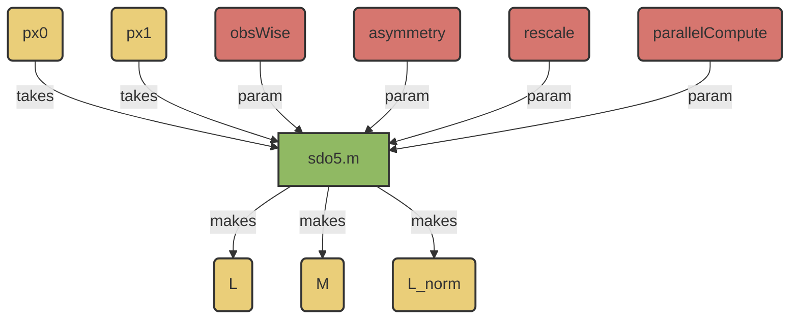

# SAT.compute.sdo5.m 

!!! warning
    This method does not provide the exact SDO, but tries to identify an SDO which can describe the assymmetric 'residual' left over. This is an approximation of the directional effects, in an attempt to subtract out the diffusion effects. 

## Algorithm

## Overview:
- 5th-Generation Estimation Algorithm for SDOs
- Uses the __Asymmetric Residual__ method. 



## Usages: 
```
 [L, M, L_norm] = sdo5(px0, px1, ...
 obswise=0, "rescale"=1, "parallelCompute"=0)
```
### Inputs
- ```px0``` 
    - [N_STATES,N_OBSERVATIONS] numeric data array; 
    - column vectors of probability distributions relating the pre-spike/pre-index interval. 
- ```px1``` 
    - [N_STATES,N_OBSERVATIONS] numeric data array; 
    - column vectors of probability distributions.  
- ```obsWise```
    - [Boolean]
    - Default = 0.
    - If true, calculate an SDO for each observation (returning a 3D array of SDOs). 
- ```"asymmetry"```
    - {'step'/'final'}
        - ```step```: Find the asymmetric residual for each SDO, then average these together. [Default]
        - ```final```: Find the net SDO (as in [V3](./m_SAT_compute_sdo3.md), then strip off the asymmetric residual. 
- ```"rescale"```
    - [Boolean]
    - Default = 1. 
    - If false, do not normalize SDOs across numbers of spikes. (The returned ```L``` and ```M``` values represent sums of dynamics instead of averages). 
- ```"parallelCompute"```
    - [Boolean]
    - Default = 0. 
    - If true, attempt to perform SDO calculations on the GPU. Requires MATLAB's parallel computing toolbox. 

### Output:  
- ```L```: The difference SDO. 
    - This is the version estimated by channel variance. 
    - This is a [N_STATES, N_STATES] matrix, unless SDOs are calculated observation-wise. 
- ```M```: This is the joint distribution of state. 
    - This version is normalized by channel variance. Normalizing each column to 1 will provide a left Markov transition matrix. 
- ```L_norm```: The difference SDO. 
    - This version is the conditional differences of state (which can be used for forward predictions from initial distributions).

