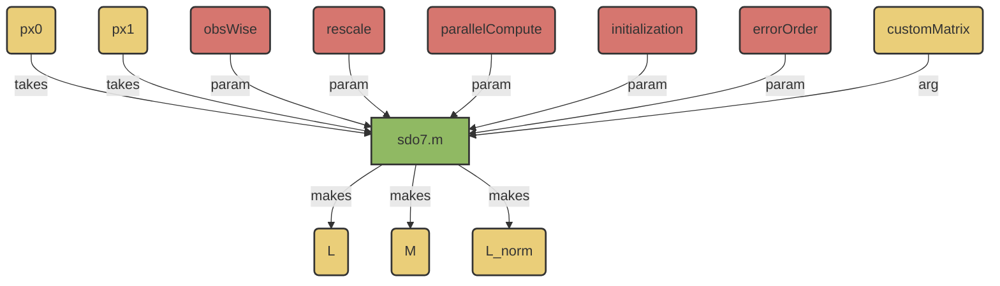

# SAT.compute.sdo7.m 

!!! warning
    This method uses MATLAB's solver methods, and inherent optimization package. This can be quite slow. 

## Algorithm

## Overview:
- 5th-Generation Estimation Algorithm for SDOs
- Uses the __Asymmetric Residual__ method. 



## Usages: 
```
 [L, M, L_norm] = sdo7(px0, px1, ...
 obswise=0, "rescale"=1, "parallelCompute"=0, "initialization"='zero', "customMatrix"=[], "errorOrder=2)
```
### Inputs
- ```px0``` 
    - [N_STATES,N_OBSERVATIONS] numeric data array; 
    - column vectors of probability distributions relating the pre-spike/pre-index interval. 
- ```px1``` 
    - [N_STATES,N_OBSERVATIONS] numeric data array; 
    - column vectors of probability distributions.  
- ```obsWise```
    - [Boolean]
    - Default = 0.
    - If true, calculate an SDO for each observation (returning a 3D array of SDOs). 
- ```"rescale"```
    - [Boolean]
    - Default = 1. 
    - If false, do not normalize SDOs across numbers of spikes. (The returned ```L``` and ```M``` values represent sums of dynamics instead of averages). 
- ```"parallelCompute"```
    - [Boolean]
    - Default = 0. 
    - If true, attempt to perform SDO calculations on the GPU. Requires MATLAB's parallel computing toolbox. 
- ```"initialization"```
    - {'zero', 'v3', 'v4', 'custom'}
        - ```zero```: Initialize from a zeros matrix. [Default]
        - ```v3```: First estimate the SDO with [V3](./m_SAT_compute_sdo3.md). 
        - ```V5```: First estimate the SDO with [V5](./m_SAT_compute_sdo5.md)
        - ```custom```: Use the matrix provided in ```customMatrix``` as a seed.
- ```"customMatrix"```: 
    - [N_STATES, N_STATES] matrix to start as an optimization seed. 
    - Only used if ```initialization``` == ```custom```
- ```errorOrder```: 
    - [2,4]
    - Whether to use parabolic (2) or quadratic (4) weighting of error residuals for optimizations. 
        - ```2```: Coarser, but faster. 
        - ```4```: Finer, but slow. 

### Output:  
- ```L```: The difference SDO. 
    - This is the version estimated by channel variance. 
    - This is a [N_STATES, N_STATES] matrix, unless SDOs are calculated observation-wise. 
- ```M```: This is the joint distribution of state. 
    - This version is normalized by channel variance. Normalizing each column to 1 will provide a left Markov transition matrix. 
- ```L_norm```: The difference SDO. 
    - This version is the conditional differences of state (which can be used for forward predictions from initial distributions).

