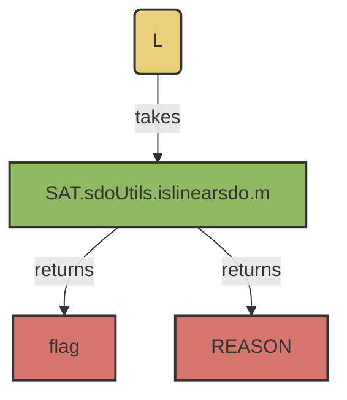

# SAT.sdoUtils.islinearsdo()

## Overview:
_Method for quickly confirming a matrix conforms to a definition of an SDO_


!!! note
     This method should be compatible with older versions of MATLAB <2019b, as it uses inputParser instead of argument parser.



## Usages: 

```
[flag, REASON] = islinearsdo(L)
```

### Inputs
 - ```L``` 
     - 'Linear Operator' to test
     - [N_STATES, N_STATES] matrix. 

### Output:  
 - ```flag```
     - Boolean [0/1]
         - ```0```: L fails to suffice assumptions
          - ```1``` - L satisfices assumptions of linear operators
 - ```REASON``` 
     - [Integer]
       - ```0```: No failures
       - ```1```: Columns do not sum to 0
       - ```2```: Positive Elements on the Diagonal
       - ```3```: Negative Elements on the Off-Diagonal
       - ```4```: Element Magnitude > 1

- ```randWalkMat```
     - [N_SIM, N_STEPS] matrix
     - Contains the discrete simulations. 

