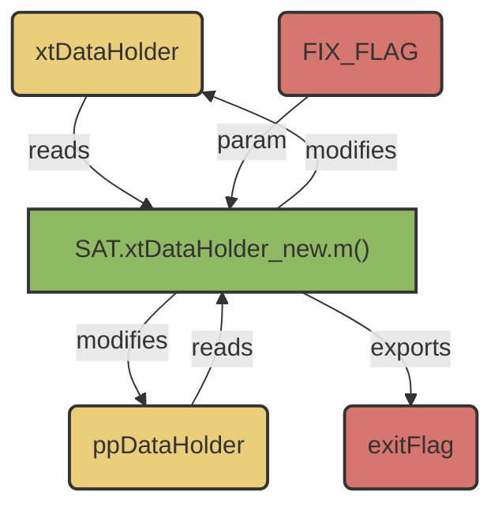

# SAT.validateDataHolders()

## Overview:
_A simple error-checking script to ensure that [xtDataHolder](./m_SAT_xtDataHolder_new.md) and [ppDataHolder](./m_SAT_ppDataHolder_new.md) structures have been properly and sufficiently populated._ 

Can perform limited error-correction. 




## Usages: 

> [xtdh, ppdh, exitFlag] = SAT.validateDataHolders(xtdh, ppdh, FIX_FLAG)

### Inputs
- ```xtdh```: [xtDataHolder](m_SAT_xtDataHolder_new.md)
- ```ppdh```: [ppDataHolder](m_SAT_ppDataHolder_new.md)
- ```FIX_FLAG```: (Positional) Boolean.
    - ```0```: Do not attempt to fix errors
     - ```1```: Attempt to fix errors

### Output:  
 - ```xtdh```: xtDataHolder. If FIX_FLAG == 1, with attempted correction. 
 - ```ppdh```: ppDataHolder. if FIX_FLAG == 1, with attempted correction. 
 - ```exitFlag```: (1,1)
     - ```0```: No errors detected; Compute SDO should work without issue. 
     - ```1```: Warnings detected; Compute SDO may compute, but there may be errors with plotting. 
     - ```2```: Critical errors detected; Compute SDO will fail. 

## Utility: 
- validate dataholders prior to use. 

## Example Code 

_Example of Successful Code_
```
>> xtdh = xtData; 
 >> ppdh = ppData; 
 %// test validation without repair 
 >> SAT.validateDataHolders(xtdh, ppdh); 
 DataHolders passed validation! 
```

_Example of Error Detection_
```
>> xtdh = xtData; 
 %// intentionally remove terminal trial to mismatch number of observations between trials 
 >> xtdh2 = xtData(:,1:end-1); 
 >> ppdh = ppData; 
 %// trial lengths are not the same size 
 >> length(xtdh2) == length(ppdh) 
 ans = 
     logical 
     0 
 %// test validation without repair 
 >> SAT.validateDataHolders(xtdh2, ppdh); 
 WARNING!: Mismatch in number of trials between structures 
```

_Example of Limited Error Detection_
```
>> xtdh = xtData; 
 %// remove terminal trial, to mismatch number of observations between trials 
 >> xtdh2 = xtData(:,1:end-1); 
 >> ppdh = ppData; 
 %// trial lengths are not the same size 
 >> length(xtdh2) == length(ppdh) 
      ans = 
      logical 
     0 
 >> FIX_FLAG = 1; 
 %// test validation without repair 
 >> [xtdh_out, ppdh_out] = SAT.validateDataHolders(xtdh2, ppdh, FIX_FLAG); 
 WARNING!: Mismatch in number of trials between structures 
 %// trial lengths are now the same size; 
 >> length(xtdh_out) == length(pdh_out) 
      ans = 
      Logical 
      1 
 %// DataHolders now pass validation 
 >> SAT.validateDataHolders(xtdh_out, ppdh_out); 
 DataHolders passed validation! 
```

## IMPORTANT NOTES  :  

!!! tip
      While this function does have limited error correction, prevention is better than a cure! If you are running into an error during validation, you may need to tweak your code. 

 This script checks that the number of rows (channels) in each trial is consistent across the entire data 
 Structure, and that each utilized field is populated.  It will give a false positive to validation if the  correct number of channels is passed to a trial, but these are in inconsistent order. 
 -  If one data structure contains more trials than the other, dummy trial data will be appended to the end of 
 the smaller data structure.  Depending on which trials  were missing on the smaller data structure, this 
 may result in a mismatching of trial data in the  xtData  and  ppData. 
 -  Dummied data structure trials pull information from the 1st trial (cell) of  xtData  and  ppData. This carries the implicit assumption that sampling frequency is consistent. 
 -  Frequency data,  ```.fs```, must be consistent within a trial  field. 
 -  There is currently no support for having trials at differing frequencies in different trials. This may 
 result in errors or false-positive validations. 
 -  If any warnings are detected, data structures should be corrected by the user. 
 -  Vector data (e.g.  ```.envelope```  ) which is present in a column vector will be transposed to a row vector 
 without raising an error.