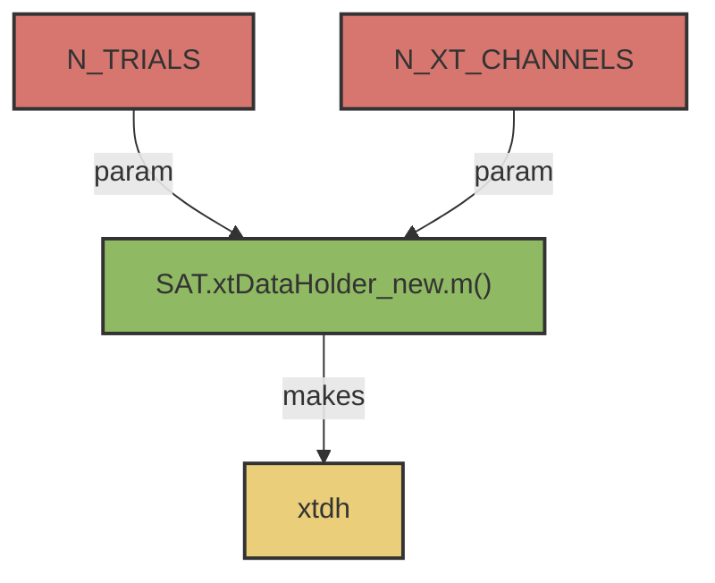

# SAT.xtDataHolder()

## Overview:
_A data structure to permit population with xtData_

- xtDataHolder  A {2 x N_TRIALS} Cell array containing analog time-series signals collected during recording trials. Each trial is represented as a column of the cell array. SDO Analysis assumes a level of stationarity to thesignal; that different trials differ in time, but not in principle signal behavior. 
- Each trial is represented as a column of the cell array. SDO Analysis assumes a level of stationarity to the signal; that different trials differ in time, but not in principle signal behavior. 




## Usages: 

> xtdh = SAT.xtDataHolder_new(N_TRIALS, N_XT_CHANNELS)

### Inputs
- ```N_TRIALS``` 
    - [Int]. Number of Trials in the dataset/ trials to use. 
- ```N_XT_CHANNELS```
    - [Int]. Number of Channels in the dataset/ channels to use. 

### Output:  
 - ```xtdh```
     - {2, N_TRIALS} cell array. 
     - __ppdh{1,N}__ contains a (1,N_XT_CHANNELS) structure to populate with primary data. Structure contains the following fields: 
        - ```.sensor```  : A string or character unique identifier corresponding to this channel's point-process data 
        - ```.envelope```: A [1,T] (Row Vector) containing the time series, sampled at the points in ```.times```. 
        - ```.times```  : A [1,K] (Row) Vector containing the event  times for the given point-process. These time points should be in the same units and relative start time as the data in the xtData channel against which it will be compared with the SDO.
        - ```.waves```  : A [K,M] Array of [1,M] waveforms associated with spiking events.
        - ```.nEvents```  : A (1,1) integer count of the number of elements  in  ```.times```.  If not populated here, will be populated during import.
        - ```.fs``` : (1,1) Numeric. Sample frequency for the spiking channels. 
        - ```.offset```: (1,1) or [1,T] numeric. Static offset applied to ```.raw``` field to provide ```.envelope```. 
        - ```.stateSignal```: [1,T] numeric. Contains the definition of state for signal in ```.envelope```. Generated during data import.  
        - ```.stateSignal```: [1,N+1] numeric. Contains the state bin ranges for N states in ```.stateSignal```. Generated during data import. 
     - __ppdh{2,N}__ contains a structure with metadata to populate. This data will be passively appended to the  sdo  structure later, to  keep track of associated pre-processing parameters associated with SDO generation. It is a structure composed of the following fields: 
          - ```.trialNumber```: [Integer]: A simple index of trial number  by position. This value is not directly utilized by the  computeSDO  code, and may be overridden. 

!!! warning
     The number of channels in the dataset must not change in number or order across channels. Channels can contain no data (in the case of xtDataCell), but the channels should still be present. 


## Utility: 
    - Generates an empty  ppData  structure, a data holder  for point process data. 
    - User data must be bungled to fit this format. 
## Prerequisites :
    - None 

## Example Code 
```
>> numberTrials = 20; 
>> numberChannels = 10; 

xtdh = SAT.xtDataHolder_new(numberTrials, numberChannels); 

for tr = 1:numberTrials
    for ch = 1:numberNeurons
        %// populate xtData;
        channelName = strcat(‘channnel’, num2str(ch));
        xtdh{1,tr}(n).sensor    = channelName;
        xtdh{1,tr}(n).envelope      = ourTimeSeriesData{n}; 
    end
end

```

_ Due to the plurality of possible data formats and structures, a single method for populating  xtData  from 
user data structures is not defined. Users will need to write a solution which navigates this process. An 
example of one potential data format (structure array) into  xtData  is given below._

## IMPORTANT NOTES  :  
- xtDataHolder  is a homogeneous structure. During data population, the row index for each trial should be consistent across the entire data cell. (e.g. ‘Neuron 3’ on row 3 in trial 1 should also be on row 3 of trial 10).

- Additional fields may be incorporated into the first row of  ppData  (primary data) array, however, these will not  be used for SDO analysis, nor passed to the  sdo  structure. 

- Additional fields may be incorporated into the second row of  ppData  (metadata) array. These fields  will be passively passed to the  sdo  structure. This permits  an investigator to pass trial-wise notes, annotation, and data pre-processing parameters into the  sdo  structure for later comparison or review. 


!!! tip
     Proper parsing of these fields can be validated with the script [```SAT.validateDataCells.m```](m_SAT_validateDataCells.md)
