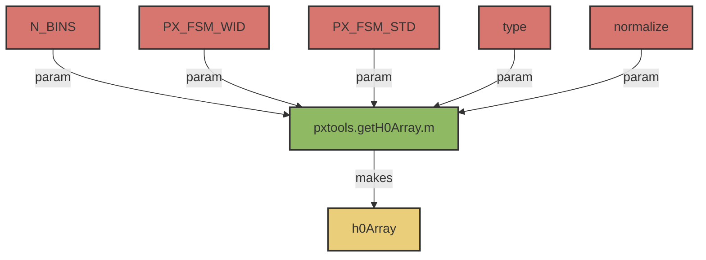

# pxTools.getH0Array()

## Overview:
_Core method for extracting a Diagonal or Gaussian Kernel Matrix_

!!! note
     This method should be compatible with older versions of MATLAB <2019b, as it uses inputParser instead of argument parser.




## Usages: 

```
[h0Array] = pxTools.getH0Array(N_BINS, PX_FSM_WID=0, PX_FSM_STD=0, 'type'='M', 'normalize'=0)
```

### Inputs
- ```N_BINS``` 
    - [Integer].
    - Number of State bins for the [```N_BINS```, ```N_BINS```] matrix. 
- ```PX_FSM_WID```
     - [Numeric] Z > 0
     - Number of states to calculate Gaussian over. (Precision)
     - if ```0```, effectively returns a diagonal matrix. 
     - Default = 0
- ```PX_FSM_STD```
     - [Numeric] N >= 0
     - The $\sigma$ of the Gaussian, in states. 
     - Default = ```0```
     - If ```0```, return a diagonal matrix. 
- ```type```
     - {'M', 'L'}
     - The type of Matrix to return: 
          - ```M```: Markov Transition Matrix 
          - ```L```: SDO (Difference) Matrix
     - Default = ```M```
- ```normalize```
     - [0/1]
     - Whether to ensure that each column sums to 1 / 0. 
     - Default = ```1```

### Output:  
- ```h0Array```
     - H0 (Gaussian) 
          - if ```L```: Return the linear difference operator. 
          - if ```M```: Return the Markov transition operator.

