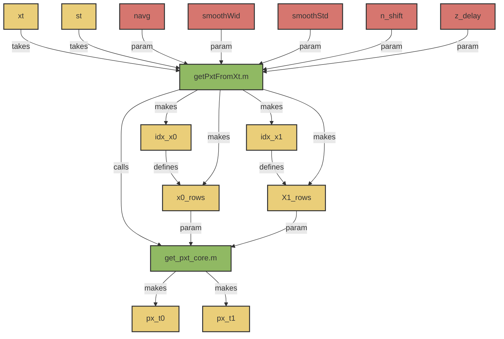

# pxTools.getXtStateMap()

## Overview:
_Core method for converting a time series into distributions of state_

!!! note
     This method should be compatible with older versions of MATLAB <2019b, as it uses inputParser instead of argument parser.

!!! bug TODO
     - I should separate out the sampling from the filtering. 
     - I should allow for differentially weighting state distributions by position (e.g., a triangular filter)




## Usages: 

```
 [px_t0, px_t1, ind_x0, ind_x1] = pxTools.getPxtFromXt(xt, st, signalLevels, ... "navg" = [20,20], "smoothWid"=0, "smoothStd"=0, "n_shift"=1, "z_delay"=0)
```

### Inputs
- ```xt``` 
    - [1,N]. Time series to extract from. 
- ```st```
    - {1,t}. List of spike indices to extract from. 
    !!! warning
         These are indices, __NOT__ times. 
- ```navg```
    - (1,1). [Integer]
        - Number of points to use in the pre-spike state (position 1) and post-spike state distribution (position 2)
        - Default = [20,20]; 
- ```smoothwid``` -
     - Integer [Z>=0]. Number of states to calculate smoothing exponential decay kernel over, to filter pxt. 
     - Default = 0; 
- ```smoothstd``` 
     - Double [N>=0]. 
     - Standard deviation of filtfilt gaussian kernel
     - Default = 0; 
- ```n_shift```
     - [Integer]. 
     - Position of the start of x1, given s=0; 
     - Default = 1; 
- ```z_delay```
     - Integer. 
     - Delay between end of px0 and start of px1; 

- ```N_XT_CHANNELS```
    - [Int]. Number of Channels in the dataset/ channels to use. 

### Output:  
- ```px_x0``` 
     - pre-spike state probabiluty distribution, columnwise
- ```px_x1```
     - post-spike state probability distribution, columnwise
- ```ind_x0``` 
     - Positional Indicies of ```xt``` used in ```px_x0```
- ```ind_x1```
      - Positional indicies of ```xt``` used in ```px_x1```

