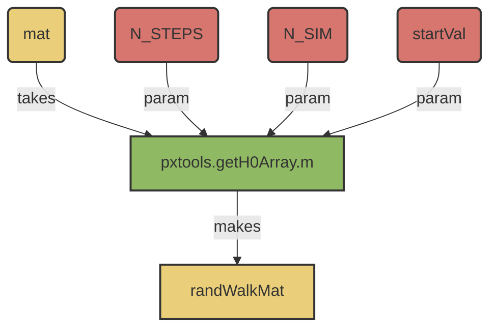

# pxTools.matrixRandomWalk()

## Overview:
_Core method for simulating stochastic realizations of signal from a static transition matrix_


!!! note
     This method should be compatible with older versions of MATLAB <2019b, as it uses inputParser instead of argument parser.




## Usages: 

```
[randWalkMat] = pxTools.matrixRandomWalk(mat, N_STEPS, N_SIM, 'startVal'='None')
```

### Inputs
- ```mat```
     - Markov transition matrix. 
- ```N_STEPS```: 
     - [Int] (Z>0)
     - Number of steps to simulate over. 
- ```N_SIM```: 
     - Number of simulations to make. 
     - [Int] (Z>0)
- ```startVal```
     - {'None', [Int], Vector}
          - ```'None'```: Initialize from a flat distribution. 
              - Default
          - ```[Int]```: Initialize from a single state. 
          - ```[Vector]```: Initialize from an input distribution.  

### Output:  
- ```randWalkMat```
     - [N_SIM, N_STEPS] matrix
     - Contains the discrete simulations. 

