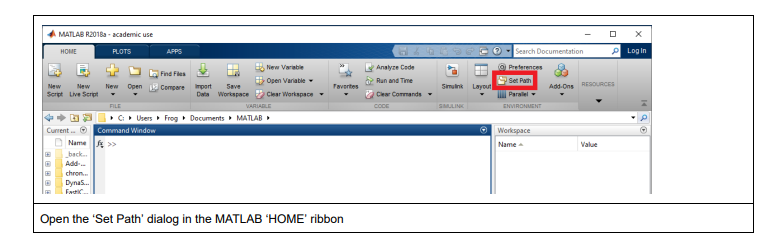
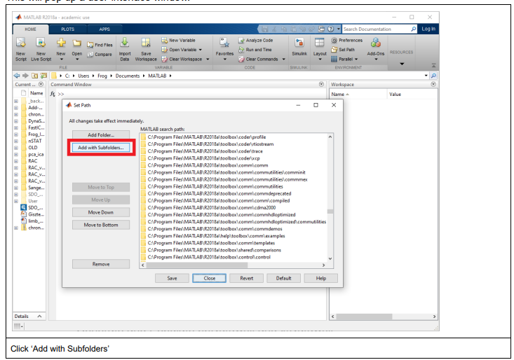
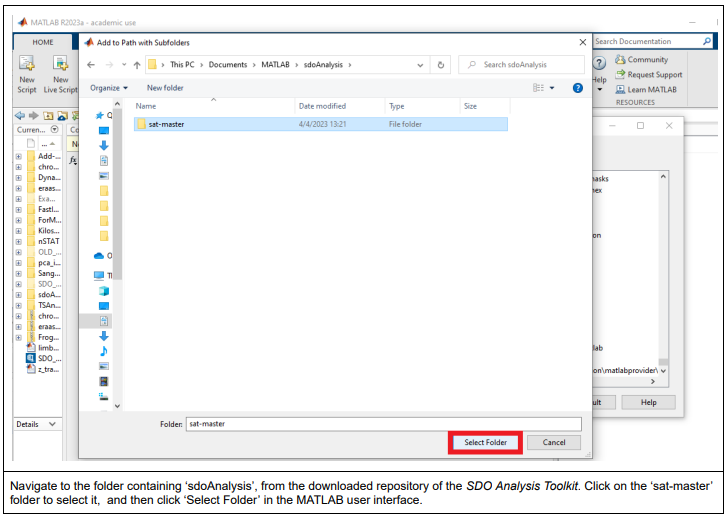
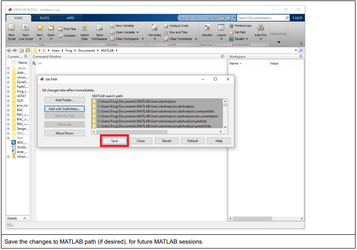
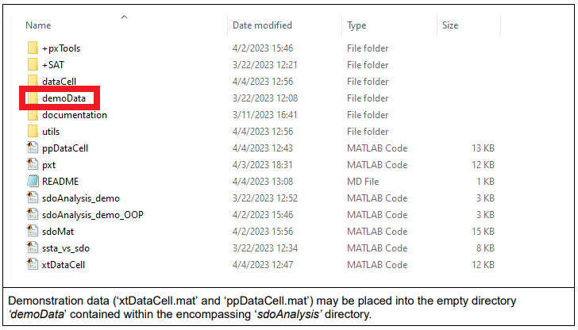
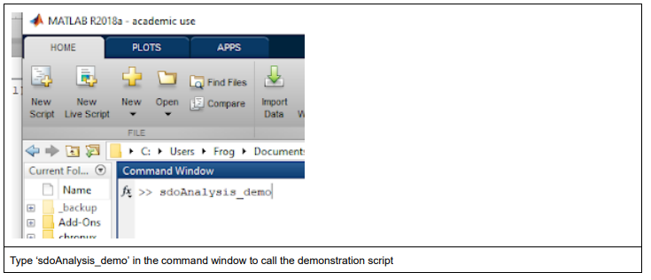
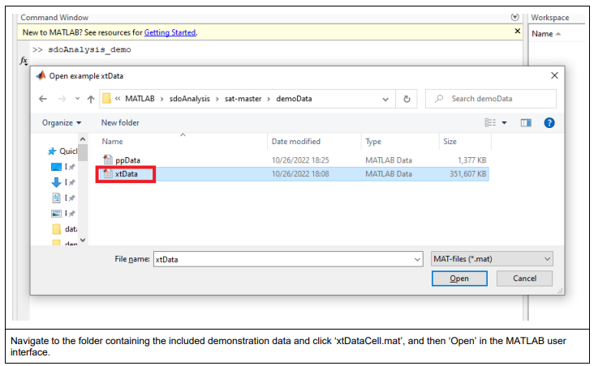
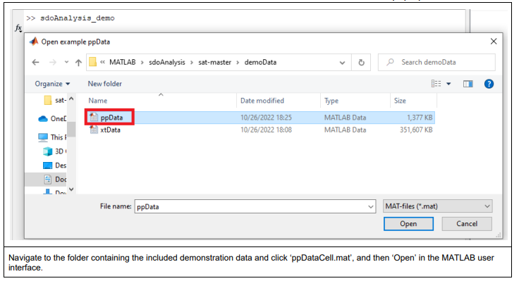
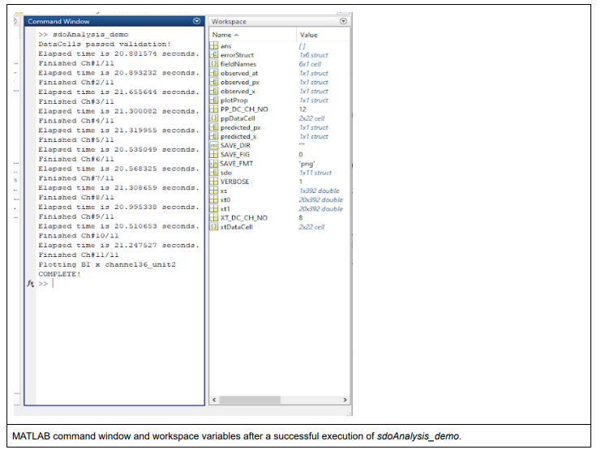
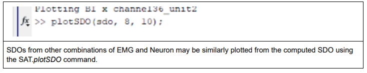

# Installing the Toolkit

_This page provides the general instructions for installing the Toolkit to the MATLAB working environment._

## Installation Steps. 

---
### 1. Add the _sdoAnalysisToolkit_ to the MATLAB Path. 

   

   - Open the 'Set Path' dialog in the MATLAB _HOME_ ribbon. 

   - This will cause a user-interface window to pop-up.

   - Click 'Add with Subfolders'. 

   

   - A new window will pop up. 

   

   - Navigate to the folder containing ```sdoAnalysis```, from the downloaded repository of the  SDO Analysis Toolkit  .  Click onnce on the ‘sat-master’ folder to select it,  and then click ‘Select Folder’ in the MATLAB user interface. 
   -  The pop-up will close, and return to the  ‘Set Path’  window in the MATLAB user interface.
   - Save the changes to MATLAB path (if desired), for future MATLAB sessions. 

   
   
   !!! warning
      This option is not available on Linux. 
      
   -  The  ‘Set Path’  pop up window will close, and MATLAB  will return to the command window. 
---

### 2. Download the Demonstration Data

!!! tip
    If you just want to validate that the toolkit is working, there are smaller data samples available in the base package. This step is only necessary if you want to replicate the paper figures. 

- Clone the full demonstration data. 
   ~~~
   git clone https://github.com/GiszterLab/SdoAnalysisToolkit_DemoData.git
   ~~~

!!! tip "Optional"
    Move the ```xtData.mat``` and ```ppData.mat``` from ```\demoData\``` directory from the demoData repo into the ```sdoAnalysisToolkit\sat-master\demoData``` directory. 



---

### 3. Run the Demo

   - #### __Option 1__: Run the programatic script.

   !!! warning
   
    MAC OS operating systems may have difficulties loading the demo data from ```.mat``` files. 

   

   - From within the MATLAB terminal: 
   ~~~
   sdoAnalysis_demo
   ~~~
   - A user interface will pop up. 
      - 

      - Navigate to the folder containing the included demonstration data and click ```example_xtData.mat```. (If you have downloaded the complete data set, you may alternatively select ```xtData.mat```.) 
   - Click "Open" in the MATLAB user interface. 
   - The interface window will close. After a moment, a second user interface window will pop up. 
      - 
      - Navigate to the folder containing the included demonstration data and click ```example_ppData.mat```.  and then ‘Open’ in the MATLAB user interface. (If you have downloaded the complete data set, you may alternatively select ```ppData.mat```.) 

      !!! note
          If during the selection process, ‘Cancel’ is  hit, or the wrong data is loaded, the command window will demonstrate an error. Run  ```sdoAnalysis_demo.m```  again,  and re-select the proper matfiles.

      - Once demonstration data has finished loading, ```sdoAnalysis_demo.m``` will automatically construct the SDO matrix structures, and plot a demonstrated spike-muscle pair. SDOs are constructed for every point process unit contained in  ppDataCell  (13) against every analog  time series data channel contained in  xtDataCell  (11). 

      

      - An update message will be displayed after finishing each analog channel (i.e. 11 updates).

      - In our experience, using the provided demo data, each analog channel takes ~10-12 seconds to run (1-2 minutes to complete). If you are using the complete demo data set, the process may take  ~40-60 seconds to run (i.e. ~8-10 minutes to complete).

      - 18 figures should be generated. The first figure should show three colored heatmaps (SDOs), and should match the below image.
         - Identification and interpretation of these plotted figures is included in the later documentation. Please refer to these sections for more information. 

      - Successful completion of the  sdoAnalysis_demo  script  should also display “COMPLETE!” in the MATLAB command window. This confirms that the  SDO Analysis  Toolkit  has been installed successfully, has all dependencies, and may  be harnessed on custom data.

      
   ___
   -  #### __Option 2__: Use the included Matlab Live Script 

!!! bug "TODO"
      _fill this section_